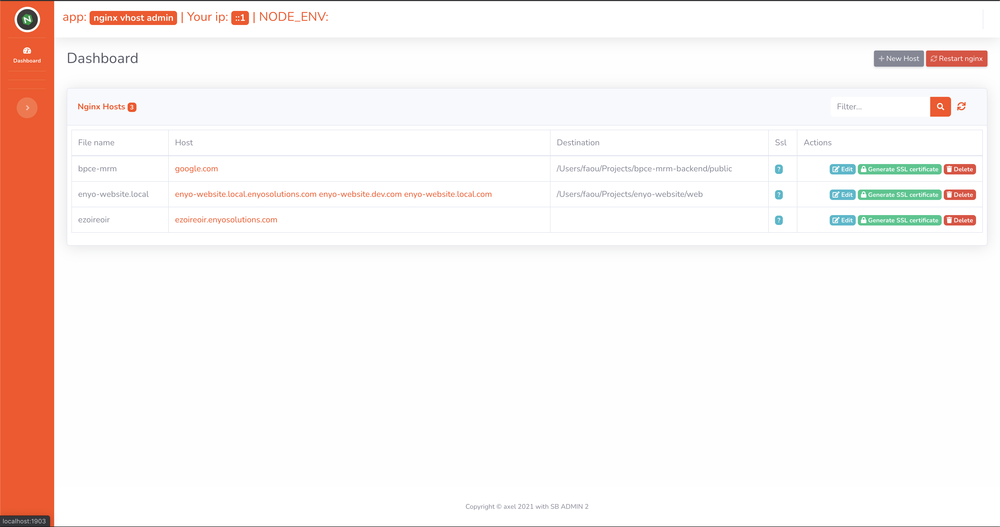
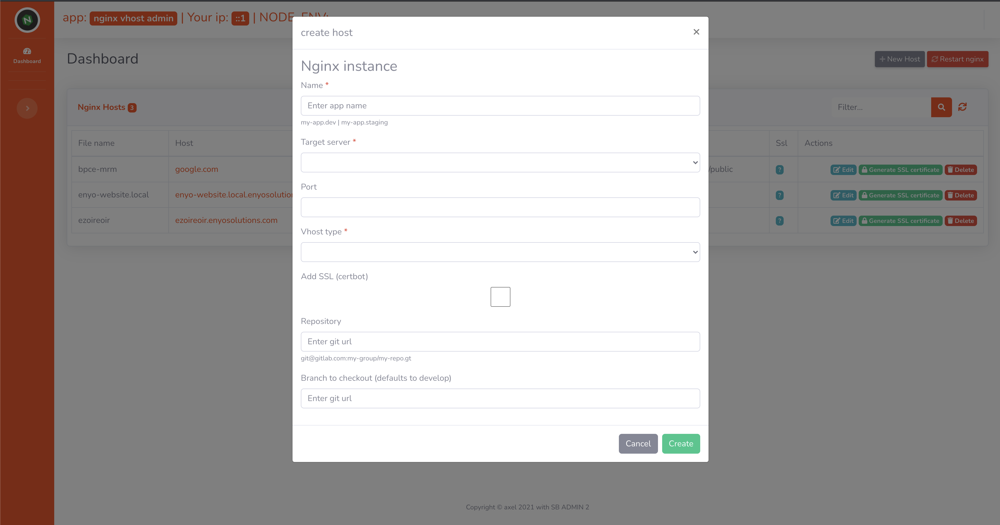
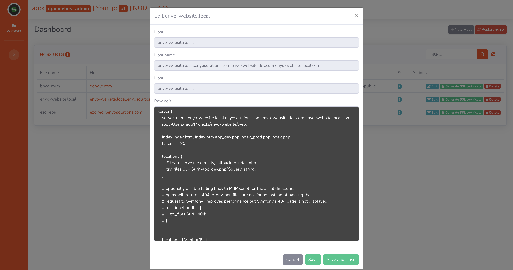

# Nginx server admin

Nginx server admin is a simple application to help you create and edit virtual hosts on your nginx installation. Deploy it on all your servers and use it to administrate data.

### Installaton

+ Pull the code
+ run `npm install`or `yarn`
+ edit the config in `config/local.js`  add all the ips you need to whitelist. This application has a strict whitelisting policy in order to reduce attack surface to hackers.

### demo

